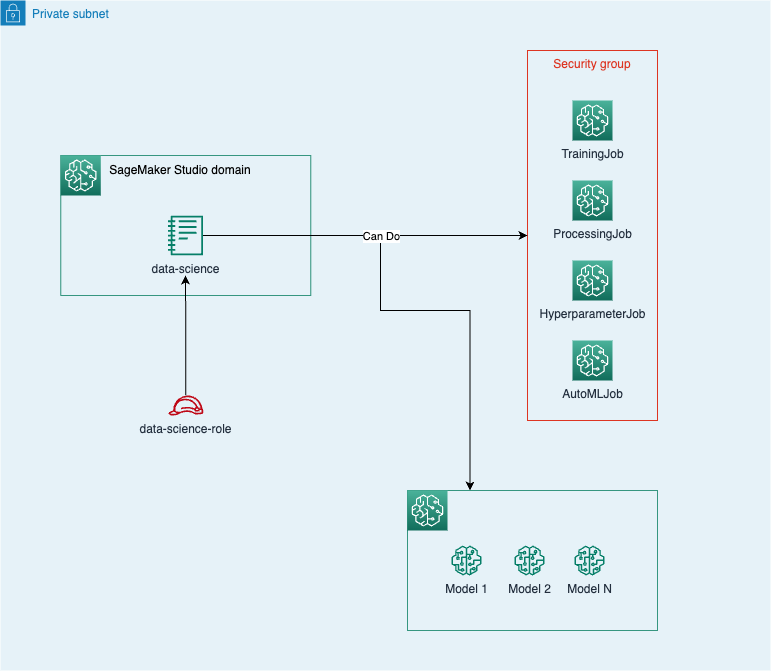
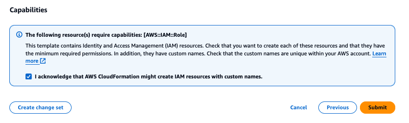
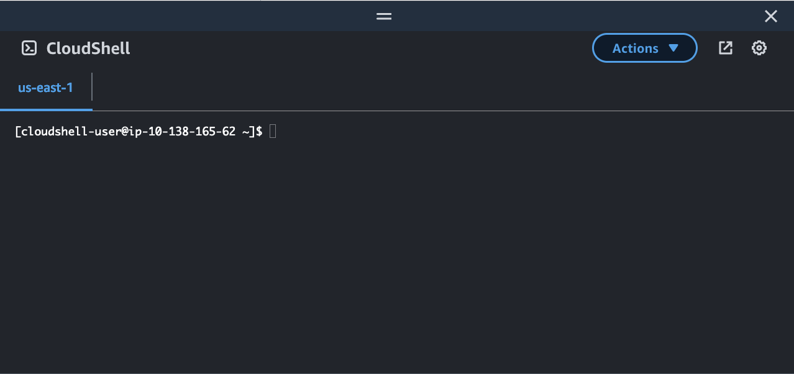
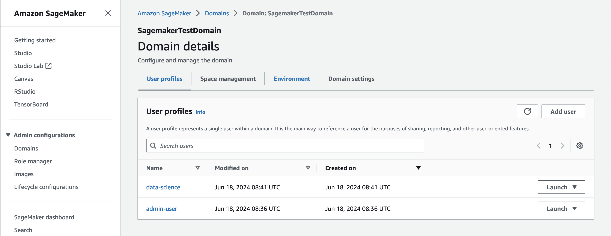
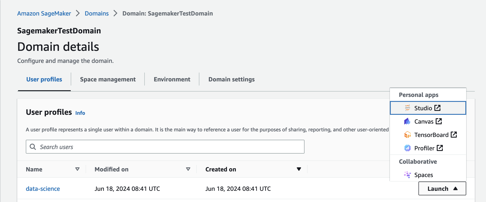

In this lab, you will learn how to enable Data Scientist users in SageMaker Studio. You will set up specific IAM permissions and a SageMaker user profile, allowing users to Create, Update, and Describe SageMaker Jobs (Training, Processing, Hyperparameter, AutoML) under a specific the VPC setup, and manage ML models in the SageMaker Model Registry.



## Setting up the environment

::alert[Make sure you've run the [lab_0_simple_sagemaker_and_sagemaker_studio_onboarding](./../lab_0_simple_sagemaker_and_sagemaker_studio_onboarding) before proceeding.]


## Use CloudFormation to provision new IAM Role and SageMaker User Profile

You can provision a new domain manually either via AWS Console or programmatically by using AWS CLI.

1. Download the CloudFormation template.

**PLACEHOLDER** Download link needs to be fixed

### Option 1: Deploy SageMaker Studio via AWS Console

To create a new domain via the AWS Console, specifically the CloudFormation console, follow the below instructions.

Open [AWS CloudFormation console](https://us-east-1.console.aws.amazon.com/cloudformation/home?region=us-east-1#/stacks/create). The link opens the AWS CloudFormation console in your AWS account. Check the selected region and change it if needed. We recommend to use `us-east-1` Region.

* Select **Upload a template file** and upload the downloaded CloudFormation template, click **Next**

* Enter the stack name, for example `datascience-user-profile`, click **Next**

* **Select I acknowledge that AWS CloudFormation might create IAM resources**, click **Submit**



On the **CloudFormation** pane, choose **Stacks**. It takes a moment for the stack to be created. When the stack is created, the status of the stack changes from `CREATE_IN_PROGRESS` to `CREATE_COMPLETE`.

### Option 2: Deploy SageMaker Studio via the AWS CLI

Open up CloudShell by clicking on the below logo at the top of your AWS console screen. 


Your screen should then look like this. 



Click on **Actions** and then **Upload file**, uploading the `datascience-user-profile.yaml` CFN template that we downloaded from the workshop page in Step 3.

In this CloudShell, without changing working directory execute the following CLI command to deploy the necessary infrastructure into your account.

```
aws cloudformation create-stack \
  --stack-name datascience-user-profile \
  --template-body datascience-user-profile.yaml \
  --capabilities CAPABILITY_IAM
  ```

## Log into the SageMaker Domain

When your SageMaker Domain has been deployed, let's go ahead and log in to the domain before taking a quick tour around the main components of the Studio homepage.

1. Search for SageMaker in the AWS Console search bar and click on it. You should be taken to the SageMaker Domain page. Click on `workshop-admin-domain`. Your screen should look similar to the following:



In the row with the `data-science`, click on `Launch` on the right hand side and then on `Studio` in the popup menu.

2. You will then be taken to the landing page of SageMaker Studio. 

